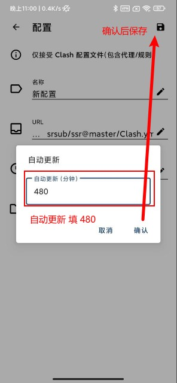
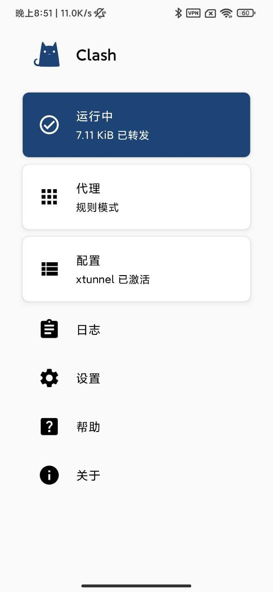
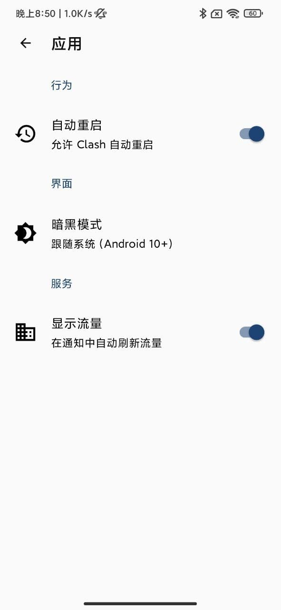

import Image from 'next/image'
import Callout from 'nextra-theme-docs/callout'

# 安卓手机
<Callout emoji="💡">
  **此教程仅供内部传阅，请勿大范围传播，请在默认浏览器打开后使用**
</Callout>

## 1 下载并安装 Clash for Android 客户端

## 2 点击这个按钮 👇👇👇

**自动更新填写 480 后，点击右上角保存**

## 3 开启服务
**回到主界面，点击顶部灰色卡片，卡片颜色变成蓝色即代表代理已开启**

## 4 设置选项

**设置-应用：打开 自动重启（可保证不被后台杀掉）**
**各机型不同，请在后台锁定Clash，防止后台杀掉**

