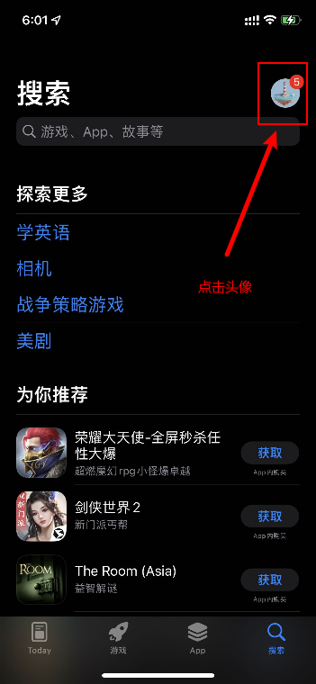
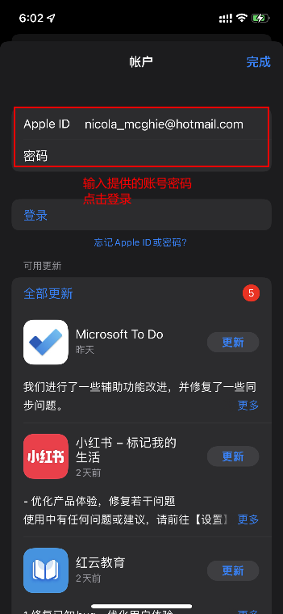
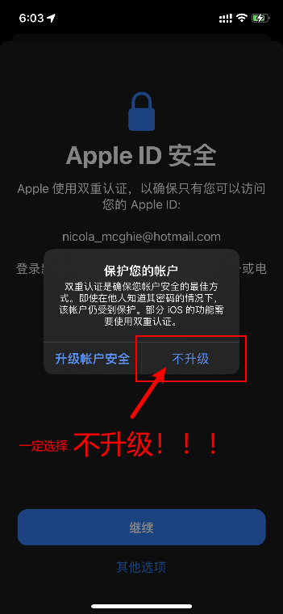
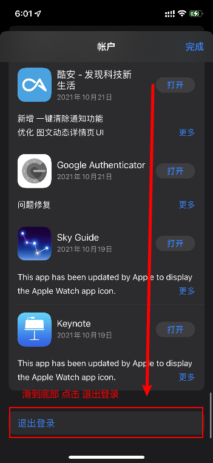
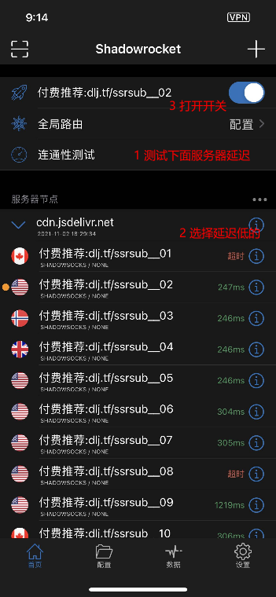
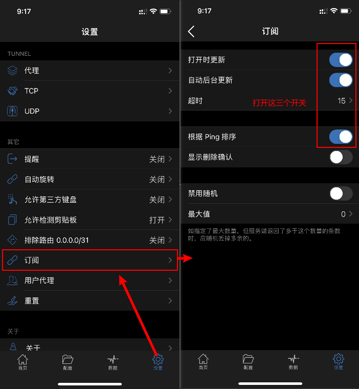

import Image from 'next/image'
import Callout from 'nextra-theme-docs/callout'

# 苹果手机
<Callout emoji="💡">
  **此教程仅供内部传阅，请勿大范围传播，请在默认浏览器打开后使用**
</Callout>

## 1 安装 小火箭 客户端

#### 1.1 打开App Store，退出登录



#### 1.2 登录下面提供的账号

<Callout emoji="💡">
  **提供的账号可能会失效，可自行注册非国区苹果账号 https://christapps.net/appleid.htm**
</Callout>

```html

账号： nicola_mcghie@hotmail.com
密码： Gzhappla5025

```

 

#### 1.3 点击下方按钮，安装客户端

[](https://apps.apple.com/us/app/shadowrocket/id932747118)

#### 1.4 安装完成后请及时退出登录



## 2 点击这个按钮 👇👇👇

[](shadowrocket://add/https://cdn.jsdelivr.net/gh/ssrsub/ssr@master/Clash.yml)

## 3 开启服务
**首先点击 连通性测试 选择一个延迟数字低的 服务器节点，点击最上面开关即可启用**

> 如果是第一次使用，会提示需要添加 VPN 连接。 点击 允许 后按系统提示操作，验证密码或 Touch ID。之后会自动返回到 小火箭 界面并启用




## 4 设置选项
**按下图设置自动更新、按延迟排序**


**若番茄失效，按下图更换可用服务器**


