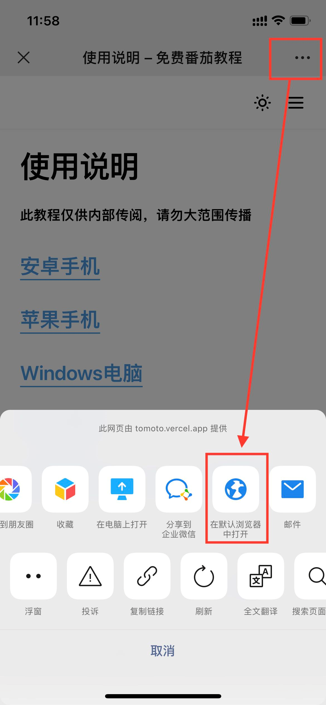

import Image from 'next/image'
import Callout from 'nextra-theme-docs/callout'

# 使用说明

<Callout emoji="💡">
  **此教程仅供内部传阅，请勿大范围传播，请在默认浏览器打开后使用**
</Callout>

## 番茄

### [安卓手机](/android)

### [苹果手机](/apple)

### [Windows电脑](/windows)

### [Mac电脑](/mac)

### [番茄后可以干什么：资源推荐](/guide)

