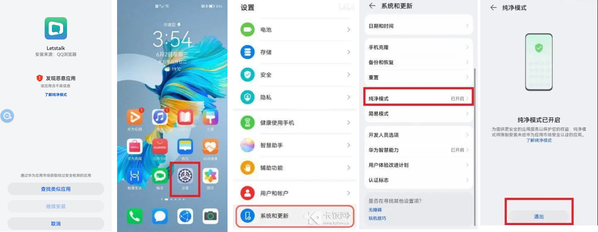
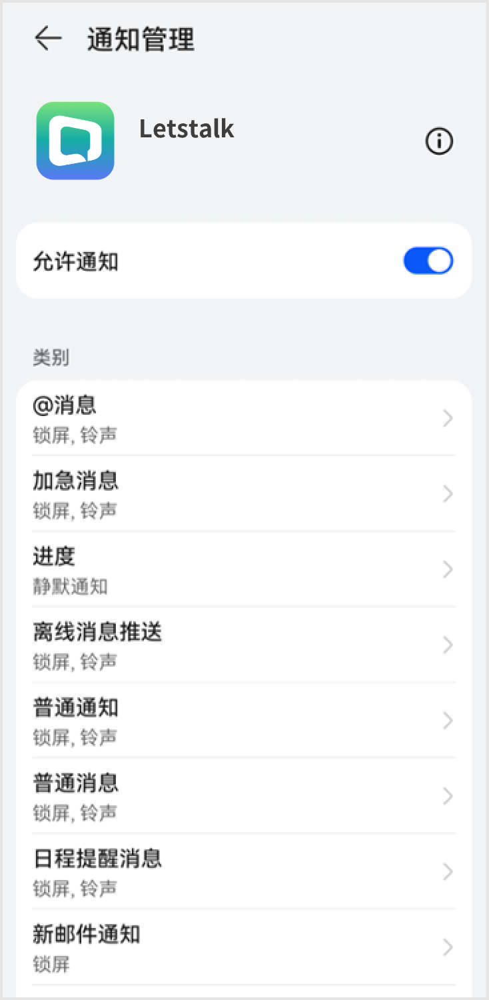
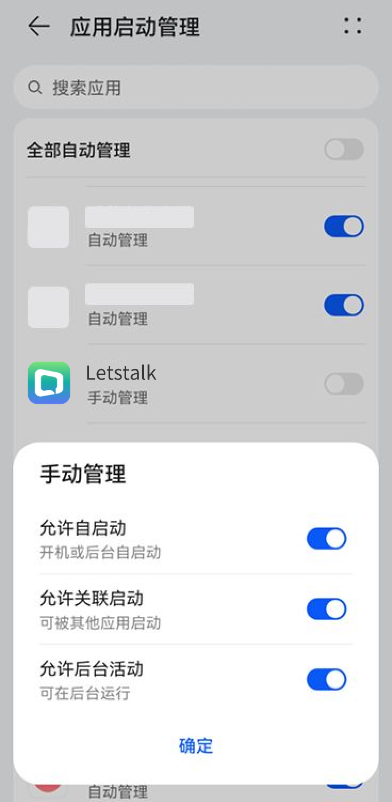
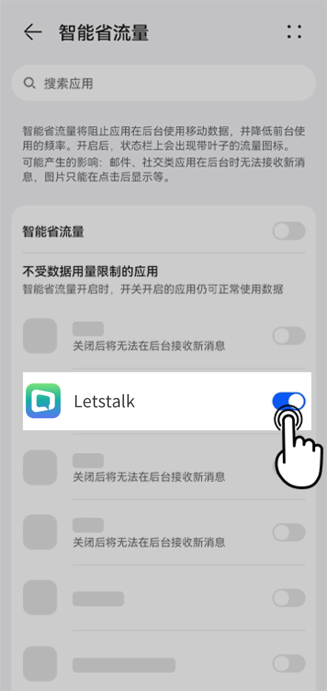
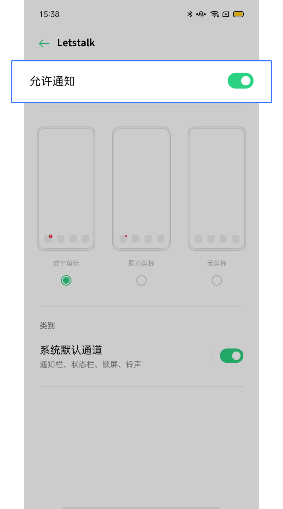
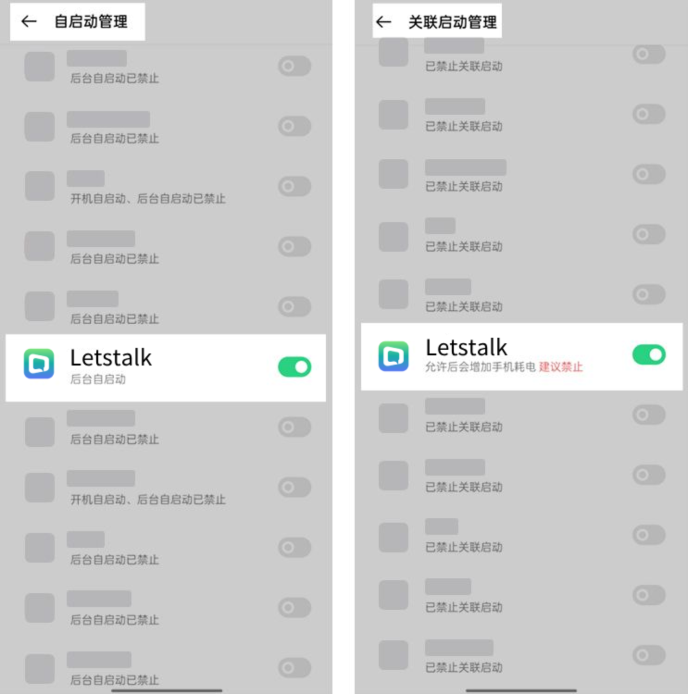
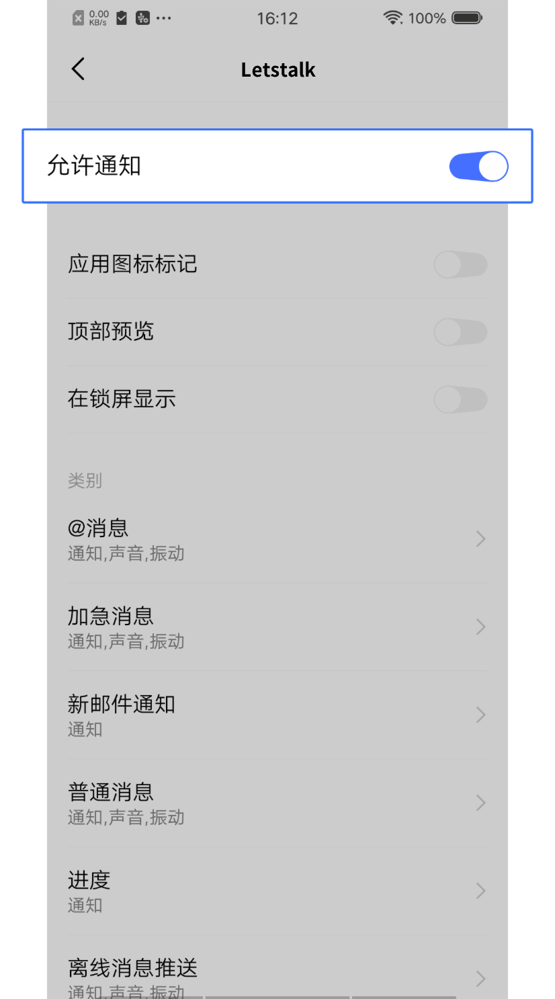
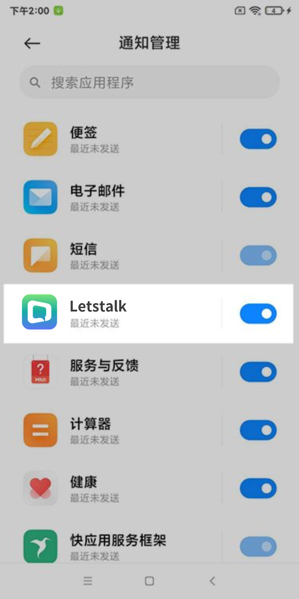
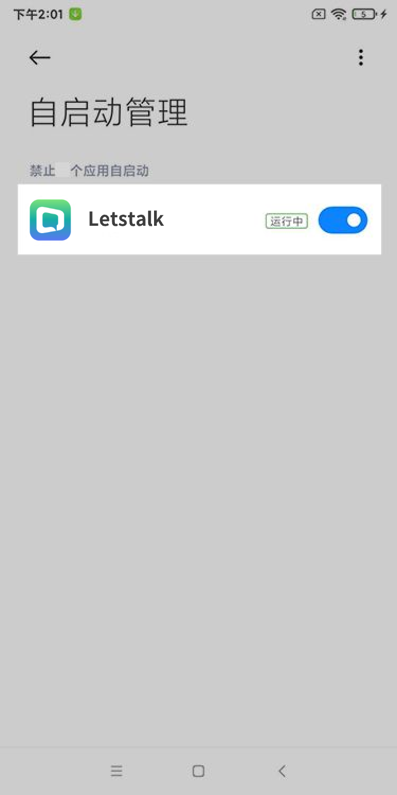

# Letstalk 使用指南

**请在默认浏览器打开此页面**

## 下载Letstalk

   

(https://Letstalk-file.oss-cn-hongkong.aliyuncs.com/InstallationFile/Letstalk_app.apk)    

## 常见问题
### 华为手机无法安装？
若华为手机提示无法安装，请按照如下操作关闭“纯净模式”后再次安装

### 安卓手机收不到消息推送？
请根据各机型引导进行通知设置

1. [华为手机](#1-华为手机)
2. [OPPO手机](#2-OPPO-手机)
3. [Vivo 手机](#3-Vivo-手机)
4. [小米手机](#4-小米手机)
5. [三星手机](#5-三星手机)

#### 1 华为手机

**注**：请确保华为 HMS core 更新为 2.6.1 版本及以上，华为 EMUI 的版本更新为 4.1 版本及以上。

##### 打开系统通知权限

1. 打开 **设置** 应用
2. 点击 **通知**
3. 在 **更多通知设置** 中打开 **通知亮屏提示**，并将**通知提示方式**设置为 **通知图标**
4. 返回通知页并找到 **Letstalk**，确认 **允许通知** 一栏为开启状态

**注**：你可以在 **允许通知** 一栏下方依次检查各类通知的设置情况，如关闭 **静默通知**、打开 **锁屏通知** 和 **横幅通知**、打开通知铃声等。

##### 应用启动管理

1. 打开 **设置** > **应用和服务** 
2. 点击 **应用启动管理**
3. 找到 **Letstalk**，确认 **应用启动管理** 为关闭状态
4. 在Letstalk的应用启动管理中，打开 **允许自启动**、**允许关联启动**、**允许后台活动** 三项开关

##### 开启智能省流量白名单

1. 打开 **手机管家** 应用
2. 点击 **流量管理** > **智能省流量**
3. 确认**不受数据用量限制的应用**中，**Letstalk** 为开启状态

#### 2 OPPO 手机

##### 打开系统通知权限

1. 打开 **设置** 应用
2. 点击 **通知与状态栏**，点击 **通知管理**
3. 找到并点击 **Letstalk**
4. 确认 **允许通知** 一栏为开启状态

##### 应用启动管理

1. 打开 **设置** 应用
2. 点击 **应用管理**
3. 找到并分别点击 **自启动管理**、**关联启动管理** 两项开关
4. 找到 **Letstalk** 并打开上述两项开关

#### **3 Vivo 手机**

##### 打开系统通知权限

1. 打开 **设置** 应用
2. 点击 状态栏与通知，点击 **管理通知**
3. 找到并点击 **Letstalk**
4. 确认 **允许通知** 一栏为开启状态

#### **4 小米手机**

##### 打开系统通知权限

1. 打开 **设置** > **通知与控制中心**
2. 点击 **锁屏通知**，确认**显示规则**为**显示通知内容**，且Letstalk的锁屏通知权限为开启状态
3. 点击 **悬浮通知**，确认**不屏蔽**已上滑的弹出通知，且Letstalk的悬浮通知权限为开启状态
4. 点击 **通知管理**，找到并确认 **Letstalk** 一栏为开启状态

##### 应用启动管理

1. 打开 **设置** 应用
2. 点击 **应用设置**
3. 找到并点击 **授权管理**，点击 **自启动管理**
4. 找到并确认 **Letstalk** 一栏为开启状态

#### **5 三星手机**

##### 打开系统通知权限

1. 打开 **设置** 应用
2. 点击 **应用程序**
3. 找到并点击 **Letstalk**
4. 点击 **通知**，并确认 **显示通知** 一栏为开启状态

##### 应用启动管理

1. 打开 **智能管理器** 应用
2. 点击右下角 **实用工具**
3. 点击 **应用程序管理**
4. 在 **自动运行应用程序** 中找到 **Letstalk**，确认 **Letstalk** 一栏为开启状态

