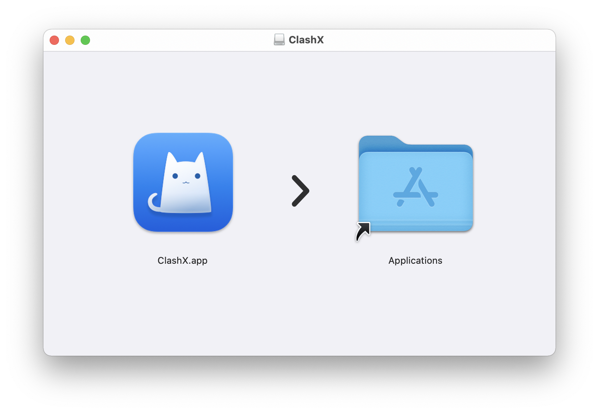
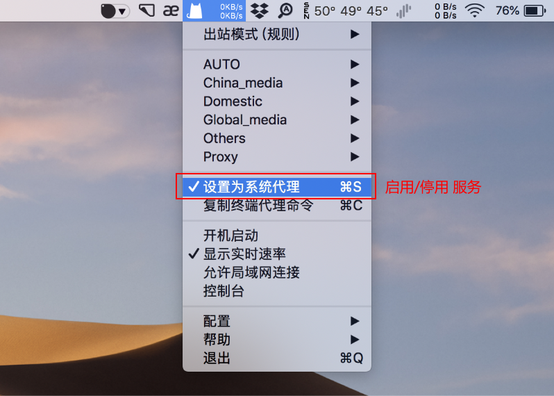
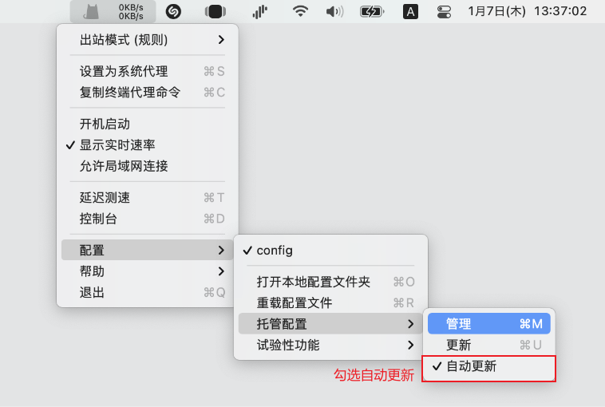

import Image from 'next/image'
import Callout from 'nextra-theme-docs/callout'

# Mac电脑
<Callout emoji="💡">
  **此教程仅供内部传阅，请勿大范围传播，请在默认浏览器打开后使用**
</Callout>

## 1 下载 ClashX 客户端，安装后运行 ClashX

## 2 点击这个按钮 👇👇👇

## 3 启用服务
**点击 ClashX 图标，勾选 “设置为系统代理” 即可启用**

## 4 设置选项
**勾选自动更新**

