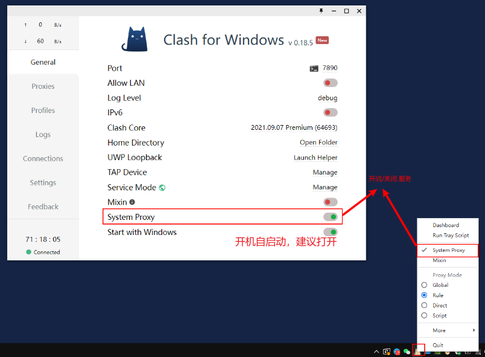
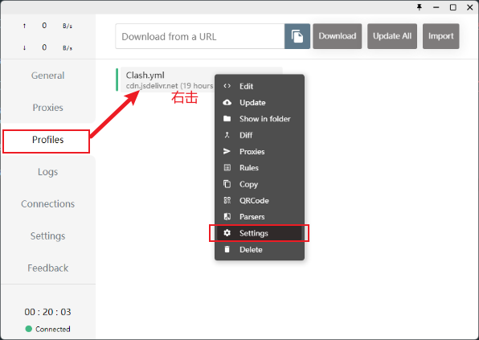
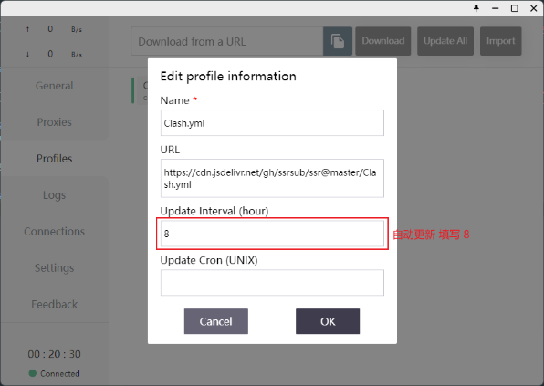

import Image from 'next/image'
import Callout from 'nextra-theme-docs/callout'

# Windows电脑
<Callout emoji="💡">
  **此教程仅供内部传阅，请勿大范围传播，请在默认浏览器打开后使用**
</Callout>

## 1 下载并安装 Clash for Windows 客户端
**安装时请选择 为使用这台电脑的任何人安装（所有用户）**
**运行时请右键，以管理员身份运行**

## 2 点击这个按钮 👇👇👇

## 3 启用服务
**打开客户端的侧边栏的 General，勾选 System Proxy 即可启用**

## 4 设置选项
**按下图设置自动更新**

